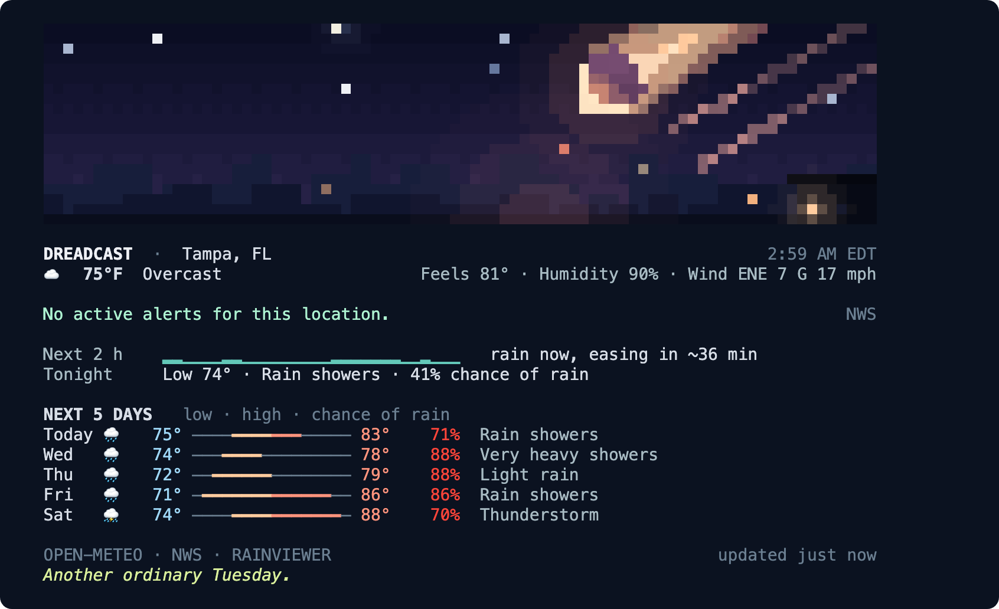
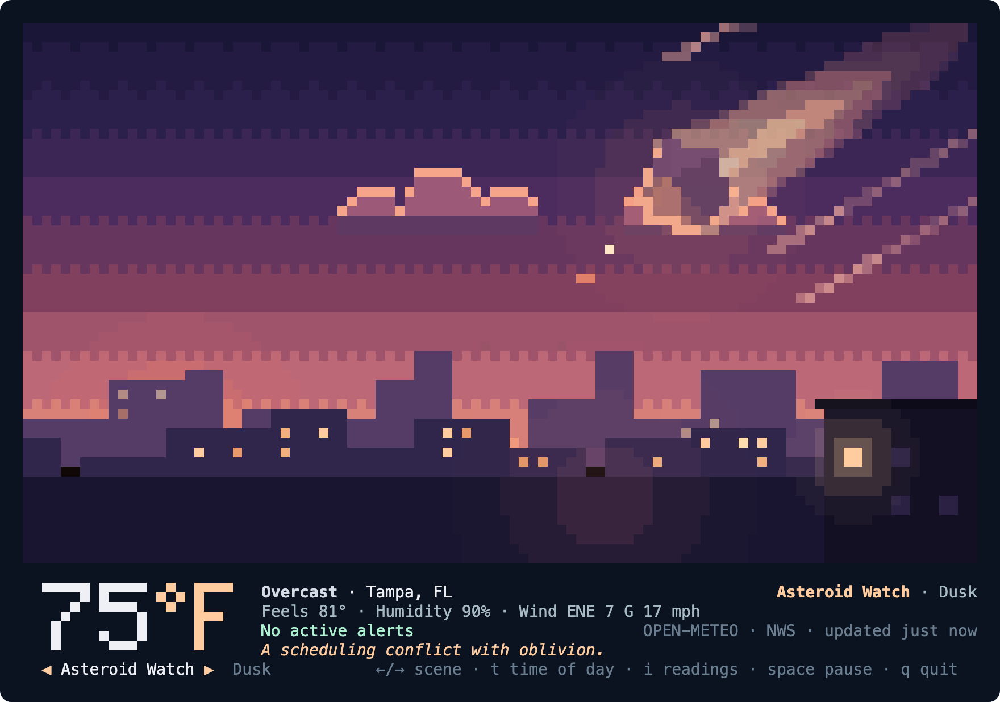

# dreadcast

**Weather and radar for the command line.** *There’s a lot in the forecast.*

`dread` is a standalone, open-source companion to **Dreadcast: Weather & Radar**, the
Mac menu-bar weather app. It doesn’t need the app, an account or a server: it reads
forecasts, radar and alerts straight from public providers, with the source and age of
every reading attached. It draws animated radar in your terminal, tells you when rain
will arrive, lists active warnings in full, fits a forecast into your shell prompt, and
brings Dreadcast’s scenes along as pixel art.



## Install

dreadcast runs on macOS 13 or later.

```sh
brew install enderwiggens/dreadcast/dreadcast
dread setup
```

Or build from source with Swift 6 (Xcode 16 or later). There are no other dependencies.

```sh
git clone https://github.com/enderwiggens/dreadcast-cli.git
cd dreadcast-cli
swift build -c release
cp .build/release/dread /usr/local/bin/   # or anywhere on your PATH
dread setup
```

`dread setup` asks for a ZIP code, place name or `lat,lon`. Coordinates are rounded to
two decimal places (about 1 km) before they are saved or sent anywhere.

## What it does

The screenshots below are real runs, captured from the terminal.

### Weather at a glance: `dread`

`dread`, or `dread weather`, shows today’s scene, current conditions, active alerts, rain
in the next two hours, recent lightning and the next five days. The scene appears in
terminals at least 38 rows tall and steps aside whenever an alert is active; the dry line
at the bottom never appears with an alert either.

### Radar: `dread radar`


```sh
dread radar                    # animate the last eight frames
dread radar --range 150        # 15, 35, 75, 150 or 300 miles
dread radar --palette viridis  # dreadcast, classic, viridis or rainviewer
dread radar --still            # just the latest frame
```

While it animates: space pauses, ←/→ step frames, +/− zoom, q quits. dreadcast reads
RainViewer’s free radar tiles and converts each pixel back to reflectivity with
RainViewer’s published color table, so the radar can be redrawn in the Dreadcast
palettes and used for timing. The basemap is Natural Earth data built into the binary.

### Alerts: `dread alerts`


Active NWS watches, warnings and advisories for your location, in full, with the
official instructions. `--follow` streams changes; `--fail-on` sets exit codes for
scripts (see [Scripts and automation](#scripts-and-automation)).

### Forecast: `dread forecast`


### Rain timing: `dread eta`


`dread eta` measures how echoes moved across the last four radar frames, then traces
backward from your location to estimate when rain arrives, how heavy it gets and when
it eases. It reports its confidence and the frames it used. It can’t foresee storms
that form or fade along the way.

### Dashboard: `dread top`


A full-screen dashboard that lists weather systems near you like processes, sorted by
threat: alerts, storm cells, lightning, severe outlook, tropical storms, wildfires, air
quality and hazards. Each source refreshes on its own schedule and fails on its own.

### Outlook: `dread outlook`


Solar activity and aurora chances, recent earthquakes, meteor showers with tonight’s
cloud cover, HF radio absorption, tsunamis, volcanoes, smoke and dust. Any commentary is
labeled and never changes a reading.

### Scenes: `dread scene`



The app’s free scenes as animated pixel art, filling the terminal, with live conditions
underneath. Each scene changes with the local time of day, from a hint of trouble at
dawn to the full situation at night, as in the app.


```sh
dread scene                        # today’s scene, animated
dread scene superstorm             # pick one
dread scene uap --time night       # dawn, day, dusk, night or auto
dread scene --still                # one frame, inline
dread config set scene asteroid    # the scene above `dread`: a name, daily or off
```

While it runs: ←/→ change scene, t cycles the time of day, i hides the readings, space
pauses, q quits. Scenes are decorative and never describe the weather; the readings
beneath them are real. With Reduce Motion, dreadcast shows a still frame. The Pro scenes
stay in the app.

### Lightning: `dread lightning`

A Braille strike map with five age bands, using your own
[Xweather](https://www.xweather.com/) account. Save credentials with
`dread auth xweather`; lightning then also appears in `dread`, `dread radar` and
`dread top`.

### Prompts and status lines: `dread prompt`

```console
$ dread prompt
☁️ 76°
```

`dread prompt` reads only the cache and returns in about 15 ms. When the cache is more
than ten minutes old it starts one background refresh, shared by every shell.

```sh
# zsh
setopt prompt_subst
RPROMPT='$(dread prompt)'

# tmux
set -g status-right '#(dread prompt --format tmux)'
set -g status-interval 60
```

```toml
# Starship
[custom.dreadcast]
command = "dread prompt"
when = true
```

```json
// Claude Code: ~/.claude/settings.json
{ "statusLine": { "type": "command", "command": "dread prompt" } }
```

## Commands

| Command | What it does |
| --- | --- |
| `dread`, `dread weather` | Today’s scene, conditions, alerts, the next two hours, lightning and five days |
| `dread radar` | Animated radar loop with ranges, palettes and lightning ages |
| `dread alerts` | Active NWS watches, warnings and advisories in full |
| `dread forecast` | Hourly and 7-day charts |
| `dread eta` | When rain reaches you, from recent radar motion |
| `dread top` | Full-screen dashboard: weather systems listed like processes |
| `dread outlook` | Solar activity, aurora, earthquakes, meteor showers and hazards |
| `dread scene` | The Dreadcast scenes as animated pixel art, with live conditions |
| `dread lightning` | Strike map in Braille dots (needs your own Xweather account) |
| `dread prompt` | A cached segment for shell prompts and status lines |
| `dread setup` | Choose a location: ZIP code, place name or `lat,lon` |
| `dread auth xweather` | Save optional lightning credentials to the Keychain |
| `dread config` | Show or change preferences |
| `dread credits` | Data sources and licenses |

Run `dread help <command>` for options. Every command accepts `--location`,
`--units imperial|metric`, `--json`, `--plain` and `--no-color`.

## Scripts and automation

`--json` gives a versioned schema on every command. `dread alerts` sets exit codes:

| Exit | Meaning |
| --- | --- |
| 0 | Nothing at or above the `--fail-on` level |
| 1 | An alert at or above the level is active |
| 2 | Usage error |
| 3 | Data unavailable or stale. Never reported as all clear |
| 4 | No location yet; run `dread setup` |

```sh
dread alerts --fail-on severe && ./start-field-crew.sh
dread alerts --follow --json | jq -r '"\(.type): \(.alert.event)"'
```

## How it draws

dreadcast detects what your terminal supports and uses the best renderer available:

| Renderer | Terminals | Result |
| --- | --- | --- |
| Kitty graphics | Kitty, Ghostty | Full-resolution radar, animated in place |
| Inline images | iTerm2, WezTerm | Full-resolution radar, redrawn each frame |
| Truecolor half-blocks | Most modern terminals | Two pixels per character cell; scenes and radar |
| 256-color | Older terminals, many SSH sessions | Same layout, quantized colors |
| Plain text and JSON | Pipes, CI, screen readers | Readings as sentences, or structured data |

Force a renderer with `--renderer`, or with `dread config set renderer halfblock`.
Inside tmux, graphics protocols are off by default. dreadcast honors `NO_COLOR` and the
macOS Reduce Motion setting; `--still` stops animation.

## Data and privacy

dreadcast has no account, no server and no analytics. Requests go directly from your
machine to each provider, and coordinates are rounded to two decimal places (about
1 km) before they are stored or sent. See [docs/PRIVACY.md](docs/PRIVACY.md) and
[docs/DATA_PROVIDERS.md](docs/DATA_PROVIDERS.md).

| Data | Provider |
| --- | --- |
| Conditions, forecasts, air quality, place search | [Open-Meteo](https://open-meteo.com/) (CC BY 4.0) |
| Radar | [RainViewer](https://www.rainviewer.com/) |
| Alerts | [National Weather Service](https://www.weather.gov/) |
| Severe outlook, tropical storms | NOAA SPC and NHC |
| Wildfires | NIFC |
| Solar activity, aurora, HF radio | NOAA SWPC |
| Earthquakes, volcanoes | USGS |
| Tsunamis | NTWC / PTWC |
| Smoke | NOAA HMS |
| Lightning (optional) | [Xweather](https://www.xweather.com/), with your own credentials |
| ZIP lookup | [Zippopotam.us](https://zippopotam.us/) |
| Basemap | [Natural Earth](https://www.naturalearthdata.com/) (public domain) |

NWS, SPC, NHC and NIFC data cover the United States. Conditions, forecasts, radar and
the outlook work worldwide.

## Development

```sh
scripts/test.sh                  # deterministic tests; no network
swift run dread --location 33602 # try it
scripts/build-basemap.py         # regenerate the embedded Natural Earth basemap
scripts/docs-images/capture.sh   # regenerate the README screenshots from live runs
```

The package has three libraries: `DreadcastKit` (providers, decoders, models),
`DreadTerminal` (capabilities, color, rasters, pixel art, image protocols) and
`DreadCLI` (commands, scenes, configuration, cache, output). See
[CONTRIBUTING.md](CONTRIBUTING.md) and [CLAUDE.md](CLAUDE.md).

## License and trademark

The code is licensed under the [Apache License 2.0](LICENSE). The Dreadcast name,
wordmark and scene names are trademarks of Dreadcast Weather and are not licensed for
use by forks; see [TRADEMARKS.md](TRADEMARKS.md). Third-party notices are in
[THIRD_PARTY_NOTICES.md](THIRD_PARTY_NOTICES.md).

*A chance of rain. Among other things.*
