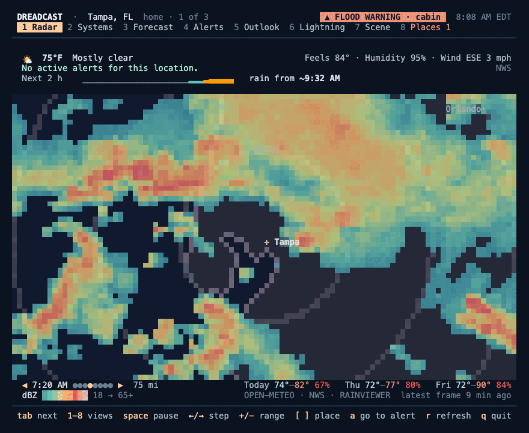
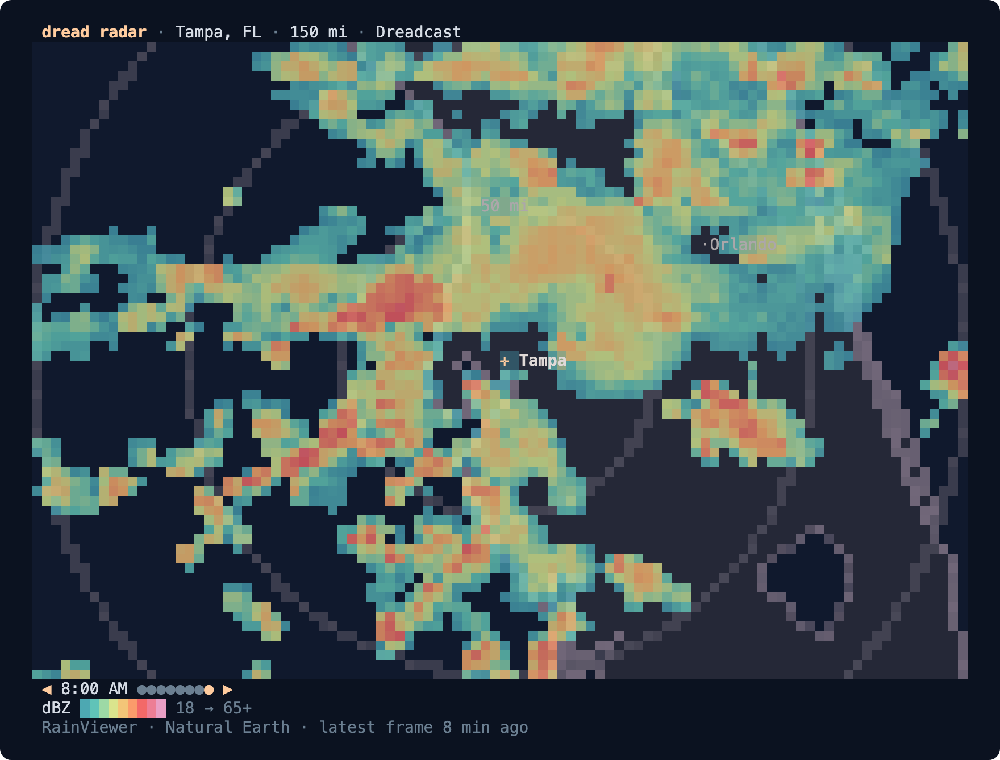
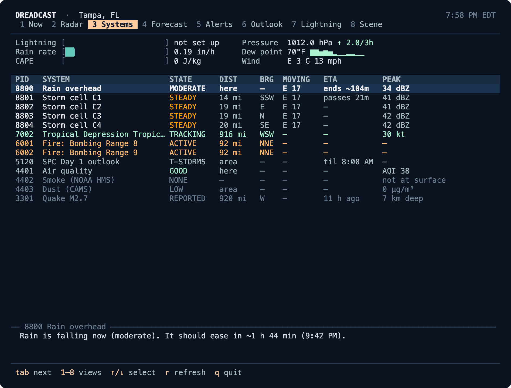
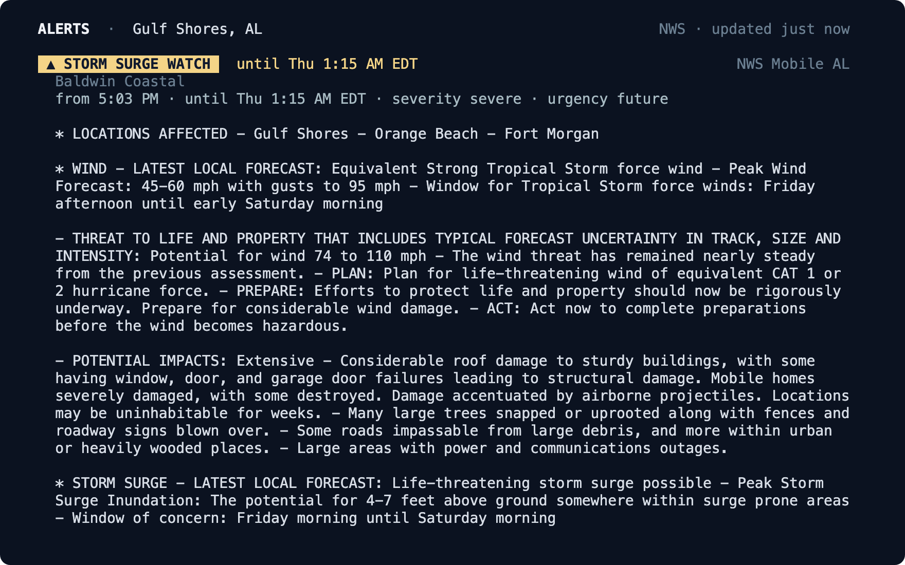
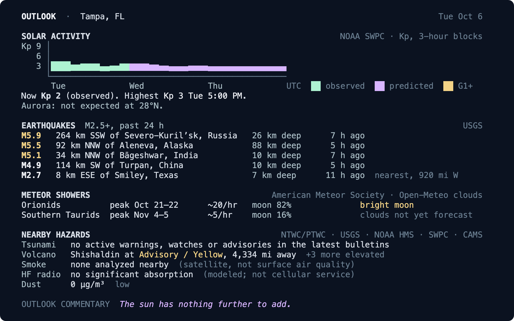
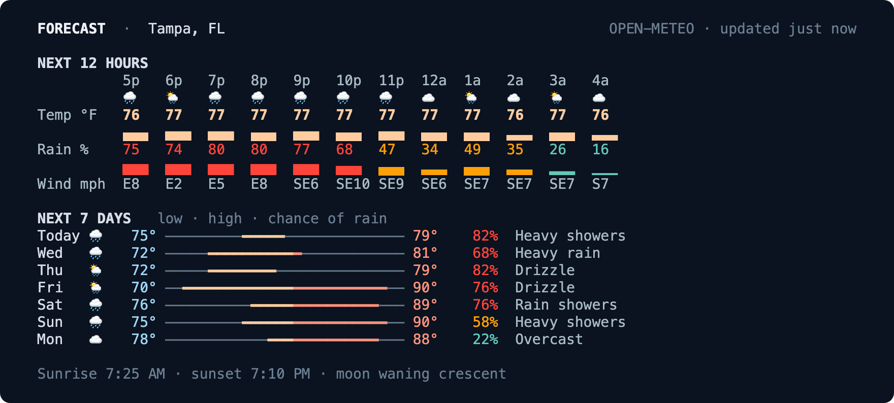
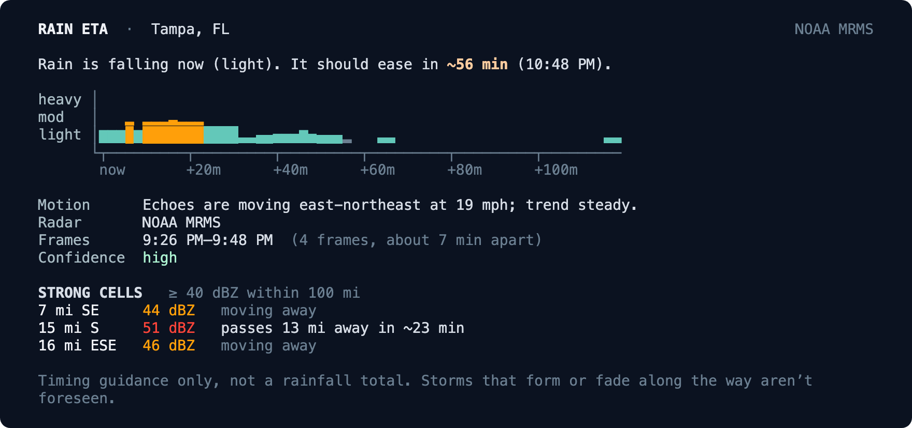
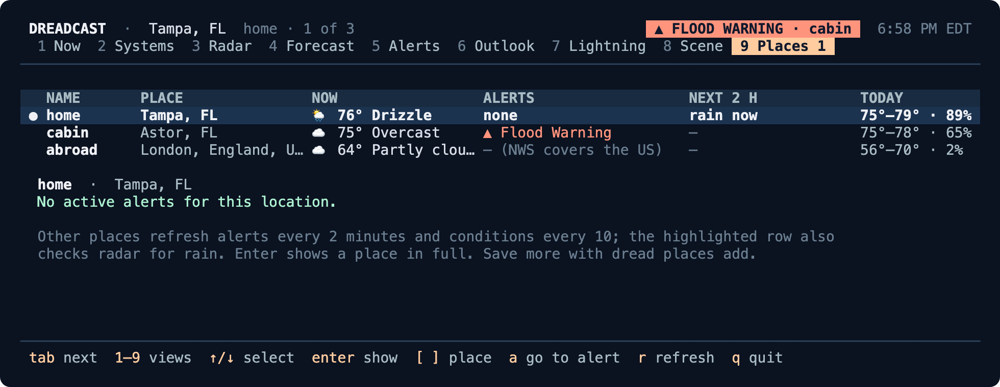
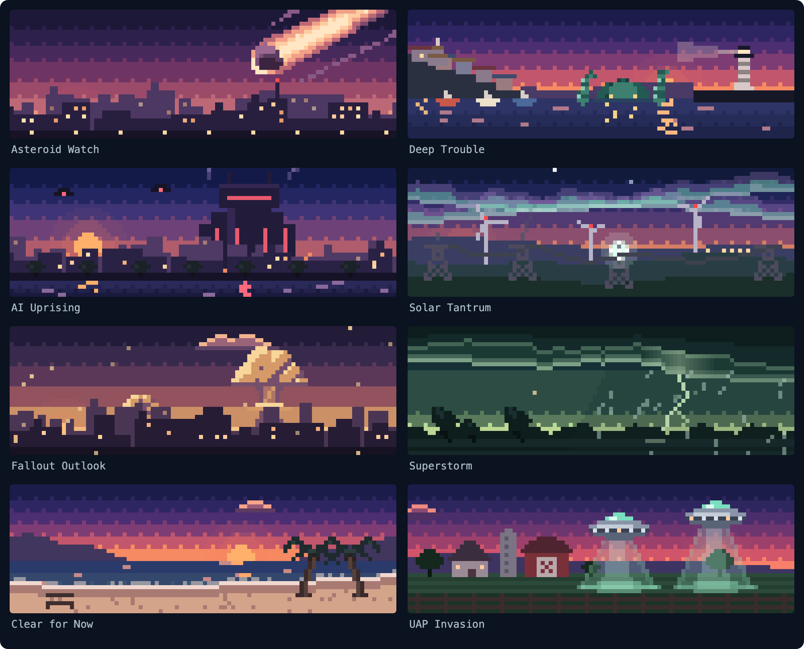

<div align="center">

# Dreadcast CLI

**Weather and radar for your terminal.**<br>
*There’s a lot in the forecast.*

[](https://github.com/enderwiggens/dreadcast-cli/actions/workflows/ci.yml)
[](https://github.com/enderwiggens/dreadcast-cli/releases/latest)
[](#install)
[](LICENSE)



</div>

```sh
brew install enderwiggens/dreadcast/dreadcast
dread setup     # a ZIP code, place name or lat,lon
dread           # live radar and conditions
```

`dread` puts live radar in your terminal, with the weather around it: animated radar
centered on you, current conditions and the next two hours above it, every active
warning in full, and a window that keeps itself up to date. It’s the open-source
companion to **DREADCAST Weather & Radar** for Mac and is laid out the same way, a
calm instrument panel with the radar first. It doesn’t need the app or an account, and
it runs on macOS and Linux.

## Highlights

- **Radar first.** Open `dread` and the last eight radar frames fill the window,
  animated, centered on you and redrawn in Dreadcast’s palettes over a built-in map.
  Conditions and the next two hours sit above it and the coming days below, as in the
  Mac app. `dread radar` draws full-resolution images in Kitty, Ghostty, iTerm2 and
  WezTerm.
- **Every warning, in full.** NWS watches, warnings and advisories with their official
  instructions. A new alert shows up in the header whichever tab you’re on.
- **When will it rain?** `dread eta` measures how storms moved over the last four radar
  frames and tells you when rain reaches you, how heavy it gets and when it eases.
- **Everything else, one keypress away.** Systems, Forecast, Alerts, Outlook, Lightning
  and Scene tabs share the same live data. Like `htop`, but for the sky.
- **All your places.** Save home, the cabin and your parents’ town. The app watches them
  all, and `--all` covers them in scripts.
- **Honest by default.** Every reading shows its source and age. Stale data says so, and
  missing data is never reported as all clear.
- **Made for scripts and prompts.** `--json` on every command, exit codes for alerts, and
  a prompt segment that returns in about 15 ms.
- **Dreadcast’s scenes.** Asteroid Watch, Deep Trouble and six more as animated pixel
  art on a tab of their own, at sunset by day and at night after dark. They don’t describe the
  weather. The numbers underneath do.

<table>
  <tr>
    <td width="50%"></td>
    <td width="50%"></td>
  </tr>
  <tr>
    <td align="center"><b>Radar</b> · <code>dread radar</code></td>
    <td align="center"><b>Systems</b> · tab 3</td>
  </tr>
  <tr>
    <td width="50%"></td>
    <td width="50%"></td>
  </tr>
  <tr>
    <td align="center"><b>Alerts</b> · <code>dread alerts</code></td>
    <td align="center"><b>Outlook</b> · <code>dread outlook</code></td>
  </tr>
  <tr>
    <td width="50%"></td>
    <td width="50%"></td>
  </tr>
  <tr>
    <td align="center"><b>Forecast</b> · <code>dread forecast</code></td>
    <td align="center"><b>Rain timing</b> · <code>dread eta</code></td>
  </tr>
</table>

## Contents

- [Install](#install)
- [Quick start](#quick-start)
- [The app](#the-app)
- [Commands](#commands)
- [Saved places](#saved-places)
- [Scenes](#scenes)
- [Prompts and status lines](#prompts-and-status-lines)
- [Scripting](#scripting)
- [Configuration](#configuration)
- [Terminal support](#terminal-support)
- [Data and privacy](#data-and-privacy)
- [FAQ](#faq)
- [Contributing](#contributing)
- [License](#license)

## Install

Dreadcast CLI runs on **macOS 13 or later** and on **Linux** (x86_64 and arm64, any
distribution).

### macOS

```sh
brew install enderwiggens/dreadcast/dreadcast
```

Or download the universal binary (Apple silicon and Intel):

```sh
curl -sSL https://github.com/enderwiggens/dreadcast-cli/releases/latest/download/dread-macos-universal.zip -o dread.zip
unzip dread.zip && sudo mv dread /usr/local/bin/
```

The binary isn’t notarized yet. Installs with Homebrew or `curl` run as they are; if
you download the zip in a browser, clear the quarantine flag first with
`xattr -d com.apple.quarantine dread`.

### Linux

[Homebrew on Linux](https://docs.brew.sh/Homebrew-on-Linux) uses the same command:

```sh
brew install enderwiggens/dreadcast/dreadcast
```

Or download a release binary. They’re fully static, so they need no libraries:

```sh
curl -sSL https://github.com/enderwiggens/dreadcast-cli/releases/latest/download/dread-linux-x86_64.tar.gz | tar xz
sudo mv dread /usr/local/bin/
```

Use `dread-linux-arm64.tar.gz` on ARM, including a Raspberry Pi 4 or 5 with a 64-bit
OS. Every archive has a `.sha256` file beside it.

### From source

You need Swift 6: Xcode 16 or later on macOS, or a
[swift.org toolchain](https://www.swift.org/install/linux/) on Linux. There are no other
dependencies.

```sh
git clone https://github.com/enderwiggens/dreadcast-cli.git
cd dreadcast-cli
swift build -c release
sudo cp .build/release/dread /usr/local/bin/
```

## Quick start

```sh
dread setup              # where are you? ZIP code, place name or lat,lon
dread                    # live radar and conditions, in the app
dread now                # a quick look, then back to your prompt
dread radar              # animated radar
dread alerts             # active warnings, in full
dread eta                # when the rain gets here
```

Coordinates are rounded to two decimal places (about 1 km) before they’re saved or
sent anywhere. To uninstall, remove the binary (or `brew uninstall dreadcast`) and the
folders listed in [docs/PRIVACY.md](docs/PRIVACY.md).

## The app

`dread` opens on **Now**: conditions, alerts and the next two hours, then live radar
filling the rest of the window, with the radar’s timeline and the coming days beneath
it. Every tab reads the same live data, and each source refreshes on its own schedule,
so switching tabs never waits on the network.

| Key | Tab | What’s there |
| :-: | --- | --- |
| `1` | **Now** | Live radar, with conditions, alerts and the next two hours above it |
| `2` | **Radar** | The radar on its own, full screen, with its scale. `space` pauses, `←` `→` step |
| `3` | **Systems** | Storm cells, alerts, fires, tropical storms and more, sorted by threat |
| `4` | **Forecast** | Hourly charts and seven days |
| `5` | **Alerts** | Every active alert in full, with what to do |
| `6` | **Outlook** | Solar activity, aurora, earthquakes, meteor showers and hazards |
| `7` | **Lightning** | Strikes from the last 20 minutes (needs an Xweather account) |
| `8` | **Scene** | The full scene, with live readings beneath it |
| `9` | **Places** | Every saved place at a glance, once you’ve saved two |

`Tab` and `Shift-Tab` move between tabs, `+` `−` change the radar’s range, `↑` `↓`
scroll or select, `[` `]` switch places, `a` jumps to the most serious alert anywhere,
`r` refreshes and `q` quits.
`Ctrl-Z` suspends it like any other program.

`dread top radar` opens straight to a tab. When output is piped, or with `--plain` or
`--json`, `dread` prints the quick look instead, so scripts and shell profiles keep
working. The app needs a window at least 60 columns by 16 rows.

## Commands

| Command | What it does |
| --- | --- |
| `dread` | The app |
| `dread now` | A quick look: conditions, alerts, the next two hours and five days |
| `dread radar` | Animated radar with ranges, palettes and lightning ages |
| `dread alerts` | Active NWS watches, warnings and advisories in full |
| `dread forecast` | Hourly and seven-day charts |
| `dread eta` | When rain reaches you, from recent radar motion |
| `dread outlook` | Solar activity, aurora, earthquakes, meteor showers and hazards |
| `dread lightning` | A strike map in Braille dots, with your own Xweather account |
| `dread scene` | The Dreadcast scenes, full screen |
| `dread places` | Save, list and manage places |
| `dread prompt` | A cached segment for shell prompts and status lines |
| `dread setup` | Choose your location |
| `dread config` | Show or change preferences |
| `dread auth xweather` | Save lightning credentials |
| `dread credits` | Data sources and licenses |

Every command accepts `--location` (or `-l`), `--units imperial|metric`, `--json`,
`--plain` and `--no-color`. Run `dread help <command>` for the rest.

<details>
<summary><b>Radar options</b></summary>

```sh
dread radar                    # animate the last eight frames
dread radar --range 150        # 15, 35, 75, 150 or 300 miles
dread radar --palette viridis  # dreadcast, classic, viridis or rainviewer
dread radar --still            # just the latest frame
```

Dreadcast CLI reads RainViewer’s free radar tiles and converts each pixel back to
reflectivity using RainViewer’s published color table. That’s what lets it redraw the
radar in other palettes and measure storm motion for `dread eta`. The basemap is
Natural Earth data built into the binary.

</details>

<details>
<summary><b>How rain timing works</b></summary>

`dread eta` measures how echoes moved across the last four radar frames, then traces
backward from your location to estimate when rain arrives, how heavy it gets and when
it eases. It reports its confidence and the frames it used. It can’t foresee storms
that form or fade along the way.

</details>

## Saved places



```sh
dread places add 32801 --name mom   # save a place under a short name
dread places                        # list them; the first is your default
dread now -l mom                    # any command takes a saved name
dread now --all                     # one line per place
dread alerts --all --fail-on severe # exit 1 if any place has a severe alert
```

You can save up to eight places. The app keeps an eye on all of them, checking alerts
every 2 minutes and conditions every 10. The place you’re looking at gets everything
else too, from radar to wildfires, so switching shows it in full within moments.

## Scenes



Dreadcast’s free scenes, redrawn for the terminal. They’re made for a dark screen, so
each shows its sunset through the day and its night version from 8 PM, when the full
situation arrives. Your scene fills the Scene tab (8) and `dread scene`, and heads the
`dread now` printout whenever no alert is active; when one is, it steps aside.

As in the Mac app, a scene is a whole theme: it brings its own highlight color and its
own map colors under the radar. Asteroid Watch glows amber over a dusky purple map; UAP
Invasion is violet over blue slate. Either can be fixed instead.

```sh
dread scene                        # your scene, full screen
dread scene superstorm --time night
dread config set scene uap         # pick yours, or daily for a new one each day
dread config set scene-banner off  # leave it off the dread now printout
dread config set highlight solar-mint  # a fixed highlight, or auto to follow the scene
dread config set map graphite      # a neutral map, or theme to follow the scene
```

Asteroid Watch is the default. It is not a forecast.

## Prompts and status lines

`dread prompt` reads only the cache, so it returns in about 15 ms. When the cache is
more than ten minutes old, it starts one background refresh shared by every shell.

```console
$ dread prompt
☁️ 76°
```

<details>
<summary><b>zsh, tmux, Starship and Claude Code</b></summary>

```sh
# zsh
setopt prompt_subst
RPROMPT='$(dread prompt)'

# tmux
set -g status-right '#(dread prompt --format tmux)'
set -g status-interval 60
```

```toml
# Starship
[custom.dreadcast]
command = "dread prompt"
when = true
```

```json
// Claude Code: ~/.claude/settings.json
{ "statusLine": { "type": "command", "command": "dread prompt" } }
```

</details>

## Scripting

Every command has `--json` output with a versioned schema (`dreadcast.now/1` and so
on). `dread alerts` is built for automation:

```sh
dread alerts --fail-on severe && ./start-field-crew.sh
dread alerts --follow --json | jq -r '"\(.type): \(.alert.event)"'
dread now --all --json | jq -r '.places[] | "\(.name) \(.now.conditions.temperature)"'
```

| Exit | Meaning |
| :-: | --- |
| `0` | Nothing at or above the `--fail-on` level |
| `1` | An alert at or above the level is active (with `--all`, at any saved place) |
| `2` | Usage error |
| `3` | Data unavailable or stale. Never reported as all clear |
| `4` | No location yet: run `dread setup` |

## Configuration

`dread config` shows your settings and where they’re stored. Change them with
`dread config set <key> <value>`:

| Key | Values |
| --- | --- |
| `units` | `imperial` or `metric` |
| `palette` | `dreadcast`, `classic`, `viridis` or `rainviewer` |
| `range` | `15`, `35`, `75`, `150` or `300` miles |
| `renderer` | `auto`, `kitty`, `iterm2`, `halfblock` or `256` |
| `scene` | a scene name, or `daily` |
| `scene-banner` | `on` or `off` |
| `highlight` | `auto` (follows the scene), `signal-blue`, `solar-mint`, `superstorm-lime`, `fallout-gold`, `lamp-glow`, `ember-red`, `afterglow-pink` or `ai-violet` |
| `map` | `theme` (the scene’s map colors) or `graphite` |
| `forecast` | `days`, `hourly` or `off`, beside the radar on the Now tab |
| `quips` | `on` or `off` (one dry line under the quick look, never during alerts) |
| `icons` | `emoji` or `ascii` |

<details>
<summary><b>Environment variables</b></summary>

| Variable | Effect |
| --- | --- |
| `DREADCAST_LOCATION` | A location for this run: a saved name, ZIP code, place name or `lat,lon` |
| `DREADCAST_CONFIG_DIR`, `DREADCAST_CACHE_DIR` | Where settings and the cache live. Otherwise `XDG_CONFIG_HOME` and `XDG_CACHE_HOME`, then the platform defaults |
| `DREADCAST_XWEATHER_CLIENT_ID`, `DREADCAST_XWEATHER_CLIENT_SECRET` | Lightning credentials instead of saved ones |
| `DREADCAST_CREDENTIAL_STORE=none` | Ignore saved credentials, for CI |
| `NO_COLOR` | Turn color off. `FORCE_COLOR` or `CLICOLOR_FORCE` keep it when piped |
| `DREAD_GRAPHICS` | Force a radar graphics protocol: `kitty`, `iterm2` or `none` |
| `DREAD_REDUCE_MOTION=1` | Still frames instead of animation (macOS also follows Reduce Motion) |

</details>

## Terminal support

Dreadcast CLI checks what your terminal can do and picks the best way to draw:

| Renderer | Terminals | Result |
| --- | --- | --- |
| Kitty graphics | Kitty, Ghostty | Full-resolution radar, animated in place |
| Inline images | iTerm2, WezTerm | Full-resolution radar |
| Truecolor half-blocks | Most modern terminals | Two pixels per character cell |
| 256 colors | Older terminals, many SSH sessions | The same, with fewer colors |
| Plain text and JSON | Pipes, CI, screen readers | Sentences, or structured data |

Inside tmux, graphics protocols are off by default. Dreadcast CLI honors `NO_COLOR` and
Reduce Motion, and `--still` stops animation anywhere.

## Data and privacy

There’s no account and no analytics. This version asks each provider directly, and
your coordinates are rounded to about 1 km before they’re stored or sent. Lightning
credentials stay in the macOS Keychain, or in a file only you can read on Linux.

Details: [docs/PRIVACY.md](docs/PRIVACY.md) and
[docs/DATA_PROVIDERS.md](docs/DATA_PROVIDERS.md).

<details>
<summary><b>Where the data comes from</b></summary>

| Data | Provider |
| --- | --- |
| Conditions, forecasts, air quality, place search | [Open-Meteo](https://open-meteo.com/) (CC BY 4.0) |
| Radar | [RainViewer](https://www.rainviewer.com/) |
| Alerts | [National Weather Service](https://www.weather.gov/) |
| Severe outlook, tropical storms | NOAA SPC and NHC |
| Wildfires | NIFC |
| Solar activity, aurora, HF radio | NOAA SWPC |
| Earthquakes, volcanoes | USGS |
| Tsunamis | NTWC and PTWC |
| Smoke | NOAA HMS |
| Lightning (optional) | [Xweather](https://www.xweather.com/), with your own credentials |
| ZIP lookup | [Zippopotam.us](https://zippopotam.us/) |
| Basemap | [Natural Earth](https://www.naturalearthdata.com/) (public domain) |

</details>

## FAQ

**Why “Dreadcast”?**
Doppler Radar for Extreme Atmospheric Disturbances.

**Does it work outside the US?**
Conditions, forecasts, radar, rain timing and the outlook work worldwide. Official
alerts, the severe outlook and wildfires come from US agencies, so they cover the
United States, and the app says so instead of showing an empty list.

**Do I need the Dreadcast app?**
No. This is a separate project that shares no code with the Mac app and never needs it.

**Why does the radar look blocky?**
Terminals draw two pixels per character cell, so the app’s radar is pixel art. In Kitty,
Ghostty, iTerm2 or WezTerm, `dread radar` shows full-resolution images instead.

**What does lightning need?**
Lightning comes from your own [Xweather](https://www.xweather.com/) account. Add your
credentials with `dread auth xweather`. Nothing else needs an account.

**Can I put it in my shell profile?**
Use `dread now` there, or `dread prompt` in your prompt. Plain `dread` opens the app
when you’re at a terminal.

## Contributing

Bug reports and pull requests are welcome. [CONTRIBUTING.md](CONTRIBUTING.md) covers
setup and what to expect in review, and [CLAUDE.md](CLAUDE.md) describes the
architecture.

```sh
scripts/test.sh                  # the full suite; never touches the network
swift run dread --location 33602 # try your changes
scripts/docs-images/capture.sh   # regenerate these screenshots from live runs
```

## License

The code is licensed under the [Apache License 2.0](LICENSE). The Dreadcast name,
wordmark and scene names are trademarks of Dreadcast Weather and aren’t licensed for
use by forks; see [TRADEMARKS.md](TRADEMARKS.md). Third-party notices are in
[THIRD_PARTY_NOTICES.md](THIRD_PARTY_NOTICES.md).

<br>

<p align="center"><i>A chance of rain. Among other things.</i></p>
