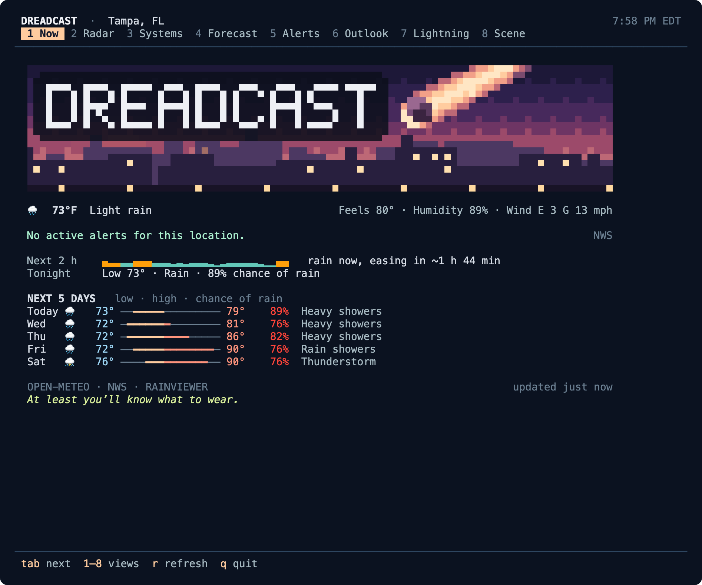

# Dreadcast cli

**Weather and radar for the command line.** *There’s a lot in the forecast.*

`dread` is a standalone, open-source companion to **Dreadcast: Weather & Radar**, the
Mac menu-bar weather app. It doesn’t need the app or an account. It reads forecasts,
radar and alerts from public weather providers, with the source and age of every
reading attached. It draws animated radar in your terminal, tells you when rain
will arrive, lists active warnings in full, fits a forecast into your shell prompt, and
brings Dreadcast’s scenes along as pixel art.



## Install

dreadcast runs on macOS 13 or later and on Linux (x86_64 and arm64, any distribution).

### macOS

With [Homebrew](https://brew.sh):

```sh
brew install enderwiggens/dreadcast/dreadcast
dread setup
```

Or download the universal binary (Apple silicon and Intel) from the
[latest release](https://github.com/enderwiggens/dreadcast-cli/releases/latest):

```sh
curl -sSL https://github.com/enderwiggens/dreadcast-cli/releases/latest/download/dread-macos-universal.zip -o dread.zip
unzip dread.zip && sudo mv dread /usr/local/bin/
dread setup
```

The binary isn’t notarized yet. Downloads made with `curl` or Homebrew run as is; if you
download the zip in a browser, macOS blocks it until you clear the quarantine flag with
`xattr -d com.apple.quarantine dread`.

### Linux

With [Homebrew on Linux](https://docs.brew.sh/Homebrew-on-Linux), the same command:

```sh
brew install enderwiggens/dreadcast/dreadcast
dread setup
```

Or download a release binary. They’re fully static, so they need no libraries and run
on any distribution:

```sh
curl -sSL https://github.com/enderwiggens/dreadcast-cli/releases/latest/download/dread-linux-x86_64.tar.gz | tar xz
sudo mv dread /usr/local/bin/
dread setup
```

Use `dread-linux-arm64.tar.gz` on ARM machines such as a Raspberry Pi 4 or 5 running a
64-bit OS. Each archive has a `.sha256` file beside it to check the download. Times
are shown in your place’s own time zone; if your system has no time zone data
(`tzdata`), dread falls back to the forecast’s UTC offset.

### From source

With Swift 6: Xcode 16 or later on macOS, or a
[swift.org toolchain](https://www.swift.org/install/linux/) on Linux. There are no
other dependencies.

```sh
git clone https://github.com/enderwiggens/dreadcast-cli.git
cd dreadcast-cli
swift build -c release
sudo cp .build/release/dread /usr/local/bin/   # or anywhere on your PATH
dread setup
```

### Getting started

`dread setup` asks for a ZIP code, place name or `lat,lon`. Coordinates are rounded to
two decimal places (about 1 km) before they are saved or sent anywhere. Then run
`dread`. To remove dreadcast, delete the binary (or `brew uninstall dreadcast`) and
the folders listed in [docs/PRIVACY.md](docs/PRIVACY.md).

## What it does

The screenshots below are real runs, captured from the terminal.

### The app: `dread`

`dread` opens a full-screen app with a tab for each view: **1 Now**, **2 Radar**,
**3 Systems**, **4 Forecast**, **5 Alerts**, **6 Outlook**, **7 Lightning** and
**8 Scene**. Tab, Shift-Tab or the number keys switch views, ↑/↓ scroll or select, `r`
refreshes, Ctrl-Z suspends and `q` quits. Every tab reads the same live data, and each
source refreshes on its own schedule and fails on its own, so switching tabs never
waits on the network. A new alert shows in the header whichever tab is open, with a
count on the Alerts tab. The app needs a window at least 60 columns by 16 rows.

Save more than one place and a ninth tab, **9 Places**, lists them all with conditions,
alerts, rain timing and today’s range. `[` and `]` switch places from any tab, Enter
on a row shows that place in full, and an alert at any place shows in the header with
its name; `a` jumps to it.

`dread top radar` (or any view's name or number) opens on that view. Piped, or with
`--plain` or `--json`, `dread` prints the quick look below instead, so scripts and
shell profiles keep working.

### Quick look: `dread now`


`dread now`, or `dread weather`, prints your scene, current conditions, active alerts,
rain in the next two hours, recent lightning and the next five days, then exits. The
scene appears in terminals at least 38 rows tall and steps aside whenever an alert is
active; the dry line at the bottom never appears with an alert either.

### Radar: `dread radar`


```sh
dread radar                    # animate the last eight frames
dread radar --range 150        # 15, 35, 75, 150 or 300 miles
dread radar --palette viridis  # dreadcast, classic, viridis or rainviewer
dread radar --still            # just the latest frame
```

While it animates: space pauses, ←/→ step frames, +/− zoom, q quits. dreadcast reads
RainViewer’s free radar tiles and converts each pixel back to reflectivity with
RainViewer’s published color table, so the radar can be redrawn in the Dreadcast
palettes and used for timing. The basemap is Natural Earth data built into the binary.

### Alerts: `dread alerts`


Active NWS watches, warnings and advisories for your location, in full, with the
official instructions. `--follow` streams changes; `--fail-on` sets exit codes for
scripts (see [Scripts and automation](#scripts-and-automation)).

### Forecast: `dread forecast`


### Rain timing: `dread eta`


`dread eta` measures how echoes moved across the last four radar frames, then traces
backward from your location to estimate when rain arrives, how heavy it gets and when
it eases. It reports its confidence and the frames it used. It can’t foresee storms
that form or fade along the way.

### Several places: `dread places`


```sh
dread places add 32801 --name mom   # save a place under a short name
dread places                        # list them; the first is your default
dread now -l mom                    # any command takes a saved name
dread now --all                     # one row per place
dread alerts --all --fail-on severe # exit 1 if any place has a severe alert
dread alerts --follow --all         # changes at every place, each line named
```

The app watches every saved place: alerts every 2 minutes and conditions every 10.
The place you’re viewing gets everything, from radar to wildfires and lightning, so
switching places shows it in full within moments. Up to eight places; each is sent to
Open-Meteo and the NWS on those refreshes, rounded to about 1 km.

### Systems: the app’s third tab


Weather systems near you, listed like processes and sorted by threat: alerts, storm
cells, lightning, severe outlook, tropical storms, wildfires, air quality and hazards.
↑/↓ select a system to read its details. `dread top systems` opens straight to it.

### Outlook: `dread outlook`


Solar activity and aurora chances, recent earthquakes, meteor showers with tonight’s
cloud cover, HF radio absorption, tsunamis, volcanoes, smoke and dust. Any commentary is
labeled and never changes a reading.

### Scenes: `dread scene`


The app’s free scenes as animated pixel art, filling the terminal, with live conditions
underneath. Each scene changes with the local time of day, from a hint of trouble at
dawn to the full situation at night, as in the app. Asteroid Watch is the default; pick
any other, or `daily` for a different scene each day.


```sh
dread scene                        # your scene, animated
dread scene superstorm             # pick one
dread scene uap --time night       # dawn, day, dusk, night or auto
dread scene --still                # one frame, inline
dread config set scene uap         # your scene: any name above, or daily to rotate
dread config set scene-banner off  # hide it on the Now tab and in `dread now`
```

While it runs: ←/→ change scene, t cycles the time of day, i hides the readings, space
pauses, q quits. Scenes are decorative and never describe the weather; the readings
beneath them are real. With Reduce Motion, dreadcast shows a still frame. The Pro scenes
stay in the app.

### Lightning: `dread lightning`

A Braille strike map with five age bands, using your own
[Xweather](https://www.xweather.com/) account. Save credentials with
`dread auth xweather`; lightning then also appears on the app’s Now, Radar and Systems
tabs, in `dread now` and in `dread radar`.

### Prompts and status lines: `dread prompt`

```console
$ dread prompt
☁️ 76°
```

`dread prompt` reads only the cache and returns in about 15 ms. When the cache is more
than ten minutes old it starts one background refresh, shared by every shell.

```sh
# zsh
setopt prompt_subst
RPROMPT='$(dread prompt)'

# tmux
set -g status-right '#(dread prompt --format tmux)'
set -g status-interval 60
```

```toml
# Starship
[custom.dreadcast]
command = "dread prompt"
when = true
```

```json
// Claude Code: ~/.claude/settings.json
{ "statusLine": { "type": "command", "command": "dread prompt" } }
```

## Commands

| Command | What it does |
| --- | --- |
| `dread` | The app: Now, Radar, Systems, Forecast, Alerts, Outlook, Lightning and Scene tabs |
| `dread now`, `dread weather` | A quick look: your scene, conditions, alerts, the next two hours, lightning and five days |
| `dread radar` | Animated radar loop with ranges, palettes and lightning ages |
| `dread alerts` | Active NWS watches, warnings and advisories in full |
| `dread forecast` | Hourly and 7-day charts |
| `dread eta` | When rain reaches you, from recent radar motion |
| `dread top [view]` | The app, opened on a view by name or number |
| `dread places` | Save places under short names; `--all` on `now` and `alerts` covers them all |
| `dread outlook` | Solar activity, aurora, earthquakes, meteor showers and hazards |
| `dread scene` | The Dreadcast scenes as animated pixel art, with live conditions |
| `dread lightning` | Strike map in Braille dots (needs your own Xweather account) |
| `dread prompt` | A cached segment for shell prompts and status lines |
| `dread setup` | Choose a location: ZIP code, place name or `lat,lon` |
| `dread auth xweather` | Save optional lightning credentials (the Keychain on macOS, a private file on Linux) |
| `dread config` | Show or change preferences |
| `dread credits` | Data sources and licenses |

Run `dread help <command>` for options. Every command accepts `--location`,
`--units imperial|metric`, `--json`, `--plain` and `--no-color`.

## Scripts and automation

`--json` gives a versioned schema on every command. `dread alerts` sets exit codes:

| Exit | Meaning |
| --- | --- |
| 0 | Nothing at or above the `--fail-on` level |
| 1 | An alert at or above the level is active (with `--all`, at any saved place) |
| 2 | Usage error |
| 3 | Data unavailable or stale (with `--all`, for any US place). Never reported as all clear |
| 4 | No location yet; run `dread setup` |

```sh
dread alerts --fail-on severe && ./start-field-crew.sh
dread alerts --follow --json | jq -r '"\(.type): \(.alert.event)"'
dread alerts --all --follow --json | jq -r '"\(.place): \(.type) \(.alert.event)"'
dread now --all --json | jq -r '.places[] | "\(.name) \(.now.conditions.temperature)"'
```

Other commands exit 0 on success, 2 on a usage error, 3 when their data is unavailable
and 4 before setup.

### Environment

| Variable | Effect |
| --- | --- |
| `DREADCAST_LOCATION` | A location for this run: a saved place's name, ZIP code, place name or `lat,lon` |
| `DREADCAST_CONFIG_DIR`, `DREADCAST_CACHE_DIR` | Where preferences and the cache live (otherwise `XDG_CONFIG_HOME` and `XDG_CACHE_HOME`, then the platform defaults) |
| `DREADCAST_XWEATHER_CLIENT_ID`, `DREADCAST_XWEATHER_CLIENT_SECRET` | Lightning credentials, instead of saved ones (`XWEATHER_CLIENT_ID` and `XWEATHER_CLIENT_SECRET` also work) |
| `DREADCAST_CREDENTIAL_STORE=none` | Ignore saved credentials, for CI and tests |
| `NO_COLOR` | No color. `FORCE_COLOR` or `CLICOLOR_FORCE` keep it when piped |
| `DREAD_GRAPHICS` | Force a graphics protocol for radar: `kitty`, `iterm2` or `none` |
| `DREAD_REDUCE_MOTION=1` | Still frames instead of animation (macOS also follows Reduce Motion) |

## How it draws

dreadcast detects what your terminal supports and uses the best renderer available:

| Renderer | Terminals | Result |
| --- | --- | --- |
| Kitty graphics | Kitty, Ghostty | Full-resolution radar, animated in place |
| Inline images | iTerm2, WezTerm | Full-resolution radar, redrawn each frame |
| Truecolor half-blocks | Most modern terminals | Two pixels per character cell; scenes and radar |
| 256-color | Older terminals, many SSH sessions | Same layout, quantized colors |
| Plain text and JSON | Pipes, CI, screen readers | Readings as sentences, or structured data |

Force a renderer with `--renderer`, or with `dread config set renderer halfblock`.
Inside tmux, graphics protocols are off by default. dreadcast honors `NO_COLOR` and the
macOS Reduce Motion setting; on Linux set `DREAD_REDUCE_MOTION=1`, and `--still` stops
animation anywhere.

On Linux, lightning credentials are saved to `~/.config/dreadcast/credentials.json`,
readable only by you, instead of the macOS Keychain.

## Data and privacy

dreadcast needs no account and has no analytics. This version requests data directly
from each provider, and coordinates are rounded to two decimal places (about 1 km)
before they are stored or sent. See [docs/PRIVACY.md](docs/PRIVACY.md) and
[docs/DATA_PROVIDERS.md](docs/DATA_PROVIDERS.md).

| Data | Provider |
| --- | --- |
| Conditions, forecasts, air quality, place search | [Open-Meteo](https://open-meteo.com/) (CC BY 4.0) |
| Radar | [RainViewer](https://www.rainviewer.com/) |
| Alerts | [National Weather Service](https://www.weather.gov/) |
| Severe outlook, tropical storms | NOAA SPC and NHC |
| Wildfires | NIFC |
| Solar activity, aurora, HF radio | NOAA SWPC |
| Earthquakes, volcanoes | USGS |
| Tsunamis | NTWC / PTWC |
| Smoke | NOAA HMS |
| Lightning (optional) | [Xweather](https://www.xweather.com/), with your own credentials |
| ZIP lookup | [Zippopotam.us](https://zippopotam.us/) |
| Basemap | [Natural Earth](https://www.naturalearthdata.com/) (public domain) |

NWS, SPC, NHC and NIFC data cover the United States. Conditions, forecasts, radar and
the outlook work worldwide.

## Development

```sh
scripts/test.sh                  # the test suite; never touches the network
swift run dread --location 33602 # try it
scripts/build-basemap.py         # regenerate the embedded Natural Earth basemap
scripts/docs-images/capture.sh   # regenerate the README screenshots from live runs
```

The package has three libraries: `DreadcastKit` (providers, decoders, models),
`DreadTerminal` (capabilities, color, rasters, pixel art, image protocols) and
`DreadCLI` (commands, the app, scenes, configuration, cache, output). See
[CONTRIBUTING.md](CONTRIBUTING.md) and [CLAUDE.md](CLAUDE.md).

The test suite covers provider decoding, rendering, the app's views and keys, and every
main command end to end, from argument parsing to exit codes, with provider responses
stubbed. It runs on macOS and Linux in CI, which also builds and smoke-tests the
static Linux binaries.

## License and trademark

The code is licensed under the [Apache License 2.0](LICENSE). The Dreadcast name,
wordmark and scene names are trademarks of Dreadcast Weather and are not licensed for
use by forks; see [TRADEMARKS.md](TRADEMARKS.md). Third-party notices are in
[THIRD_PARTY_NOTICES.md](THIRD_PARTY_NOTICES.md).

*A chance of rain. Among other things.*
